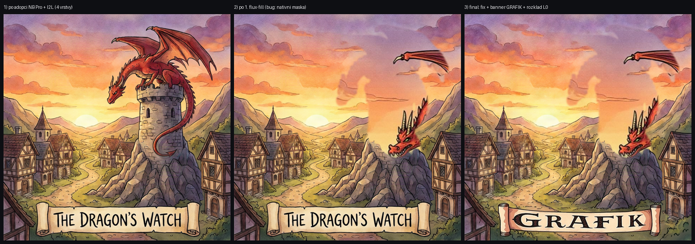

# M4 E2E — koš, cost tracking, NB Pro generace, flux-fill, rekurzivní dekompozice (2026-08-15)

Klikáním v reálném Chrome (claude-in-chrome MCP) nad čerstvě vygenerovaným projektem; API `uvicorn:8300 --access-log` (logs/uvicorn-m4*-out.log), vite:5173, oba z hlavního checkoutu. Nativní `window.confirm` je přes CDP nedosažitelný → v driveru přepsán `window.confirm = () => true` (potvrzovací dialogy se v ručním provozu chovají normálně).

**Placené cally: 5× = $0.338 dle vlastního cost ledgeru (self-test trackingu ✓ — ledger přesně sedí na provedené akce).**

## Scénář (akceptace M4) a výsledky

### 1. Koš: smazat → najít v koši → obnovit ✓
- `m4-kos-test` smazán přes UI (🗑 + potvrzení) → adresář přesunut do `projects/.trash/20260815-032133-m4-kos-test.grafik` (žádné rm; history.json a costs.jsonl putují uvnitř adresáře).
- Sekce **Koš ▸ (1)** → rozbaleno: položka se jménem, časem smazání a ↩; tlačítko „Vysypat koš"; hint o 30denním auto-úklidu.
- Obnovit → projekt zpět v seznamu, **stejné id** (9540956f3c1b), adresář zpět jako `m4-kos-test.grafik`, vrstvy intaktní; koš prázdný.
- `logs/destructive.jsonl`: `project-delete` (s trash_entry) i `trash-restore` zapsané. Auto-úklid >30 dní + kolizní scénáře (jméno adresáře, openart-defense na kolizi id) kryté testy (`tests/test_api_m4.py`).
- Po ověření koše smazána incidentová záloha `projects-backup-20260815-023235/` (M2.5).

### 2. Vygenerovat vstupní obrázek (NB Pro) → rozložit ✓
- Toolbar **Vygenerovat** → modal (prompt EN „A red dragon perched on a stone tower above a small medieval village at sunset…", poměr 1:1, rozlišení 1K) → náhled 1024×1024 za ~40 s. Klíč nalezen **read-only fallbackem z NG-ROBOT `.env`** (`GOOGLE_GEMINI_API_KEY`; GRAFIK `.env`/`key.env` klíč nemají). $0.134.
- **Převzít → rozložit na 4 vrstvy**: create project + attach cost entry + standardní `decompose/file` (I2L ~2,5 min) → 4 vrstvy (nativní PNG 640×640, layout 1024×1024 na canvas — M2.5 fix drží). $0.05.
- Chybová cesta bez klíče: kryta testem (`503` s čitelným výčtem env proměnných); v živém běhu klíč existoval.

### 3. Editovat prvek přes flux-fill ✓ (+ nález a fix)
- **1. pokus** („make the dragon bright green", vrstva draka): doběhl (29,5 s, $0.052), ale odhalil **regresi layout-vs-native** — maska z nativní alfy (640²) místo layout (1024²) mířila mimo prvek a vrstvu přepsal zmenšený výřez. Fix `f6a0cba` (ai-edit i inpaint-behind v layout prostoru) + 2 regresní testy; vrstva draka zůstala pixelově obětovaná (undo = jen metadata — známý limit M3). Viz LEARNINGS „Layout quad".
- **2. pokus po fixu** (banner, fill-style prompt „an old parchment banner scroll with the text GRAFIK painted in bold dark medieval letters…"): 20,1 s, $0.052 — banner nyní čte **GRAFIK**, edit přesně lokalizovaný: **pixel-diff uvnitř masky banneru 72,86, mimo masku 3,66** (mimo-masková složka sdílená s rekonstrukcí po rozkladu L0 níže).
- Druhý nález: fill sémantika — model nevidí původní obsah masky, prompt musí popisovat cílový obsah díry (viz LEARNINGS „Fill model").

### 4. Rozložit vrstvu na podvrstvy ✓
- Inspector → **Rozložit vrstvu** (Podvrstvy 3) nad `Layer 0` (pozadí, plná alfa) → I2L ~3 min, $0.05 → `Layer 0 / 1..3` spliced na z 0–2 se zděděným layout quadem (0,0,1024,1024), ostatní vrstvy posunuty na z 3–5.
- Kompozit po rozkladu vizuálně shodný (rekonstrukční odchylka viz čísla).
- **Zpět** → původní `Layer 0` zpátky (4 vrstvy) — původní PNG zůstává na disku, undo je i pixelově úplné. **Znovu** → podvrstvy zpět (6 vrstev). Na disku 7 layer PNG (4 původní + 3 sub).

### 5. Vidět útratu projektu ✓
- Sidebar panel **Útrata**: `Projekt: $0.34 · 5 volání`, `Session celkem: …` (per API proces — po restartu se session nuluje, ledger na disku drží), poslední položky s kind/endpoint/cenou; chip `Útrata: $0.34` ve status stripu.
- Živě ověřeno: součty rostly po každé placené operaci (0.00 → 0.18 → 0.24 → 0.29 → 0.34).

## Cost ledger (`projects/e2e-m4-dragon.grafik/costs.jsonl` — kompletní obsah)

| ts (UTC) | endpoint | kind | jednotky | est_usd |
|---|---|---|---|---|
| 03:24:39 | google/nano-banana-pro-preview | image_gen | 1 call (1024×1024) | 0.134 |
| 03:29:33 | fal-ai/qwen-image-layered | decompose | 1 call (num_layers=4) | 0.05 |
| 03:33:08 | fal-ai/flux-pro/v1/fill | image_edit | 1.0486 MP | 0.0524 |
| 03:44:44 | fal-ai/flux-pro/v1/fill | image_edit | 1.0486 MP | 0.0524 |
| 03:48:49 | fal-ai/qwen-image-layered | decompose | 1 call (num_layers=3) | 0.05 |

Součet **$0.3388** (UI zobrazuje $0.34). Sazby = odhady z registry (fal model pages / ai.google.dev, fetch 2026-08-15 — sekundární zdroj, viz price_note per entry).

## Čísla
- pytest: **147 offline** (24 nových `tests/test_api_m4.py`, z toho 2 regresní na layout-vs-native z tohoto E2E).
- flux-fill: 29,5 s / 20,1 s; NB Pro ~40 s; I2L ~2,5–3 min na volání.
- pixel-diff banner editu: uvnitř masky 72,86 / mimo 3,66 (mean |Δ|/kanál, 0–255).
- 0 chybových bannerů v UI během finálního průchodu; access log kompletní (uvicorn-m4b-out.log).

## Provozní nálezy (driver)
1. Nativní `confirm()` v CDP-řízeném Chrome nejde odkliknout → `window.confirm = () => true` před destruktivními akcemi (po každém reloadu znovu).
2. `Page.captureScreenshot` po DOM mutaci intermitentně timeoutuje (30 s); druhý pokus po ~2 s projde — screenshot brát až po krátkém wait, ne hned po kliku.
3. `find()` refy zastarávají po překreslení panelů (přepnutí vrstvy vyměnilo pravý sloupec a klik na starý ref tiše nic neudělal) — refy brát čerstvé těsně před klikem, úspěch ověřovat přes `window.__editorState.busy`.
4. `save_to_disk` screenshoty končí mimo repo → obrazová evidence přes API komposity (níže). Capture celé obrazovky (.NET CopyFromScreen) zachytil cizí okno — nepoužívat, riziko privátního obsahu.

## Obrazová evidence

- `img/m4-before-flux.png` — kompozit po adopci NB Pro obrázku + I2L (4 vrstvy)
- `img/m4-after-flux.png` — po 1. flux-fill pokusu (zachycený bug: obsah přemístěn, věž pryč)
- `img/m4-final.png` — final: layout fix, banner „GRAFIK", pozadí rozložené na 3 podvrstvy (vizuálně beze změny)

Živý projekt ponechán jako `e2e-m4-dragon` (konvence e2e-*); `m4-kos-test` ponechán v koši (`20260815-035226-…`) jako živá ukázka — auto-úklid ho smaže po 30 dnech.
