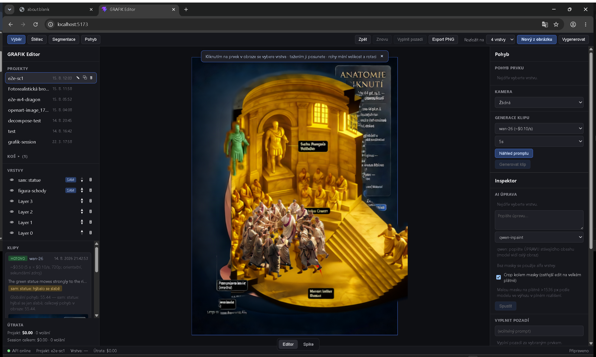
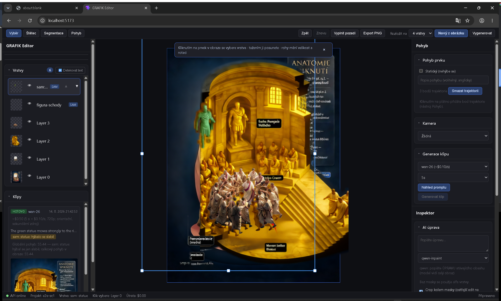
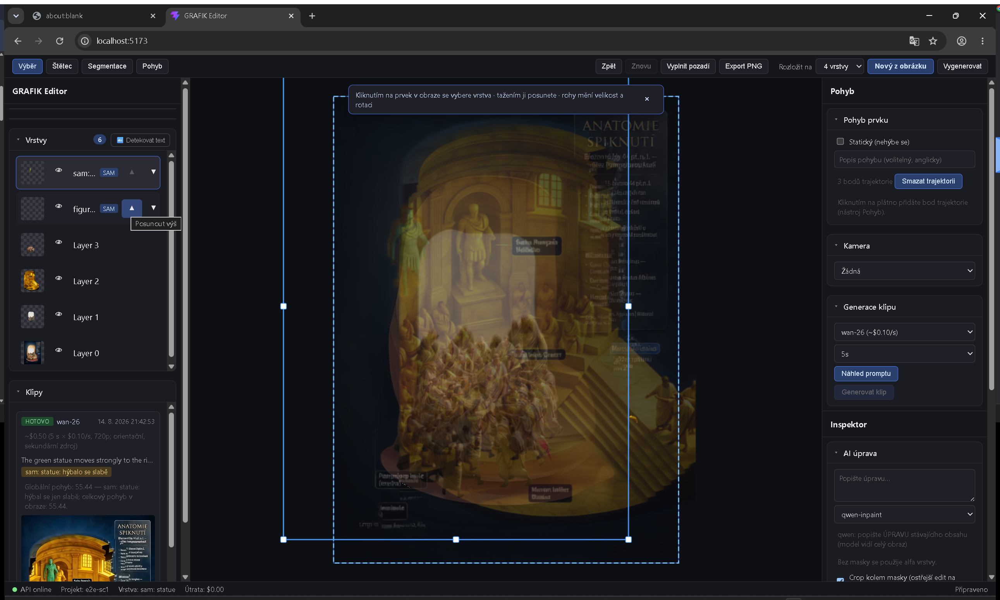
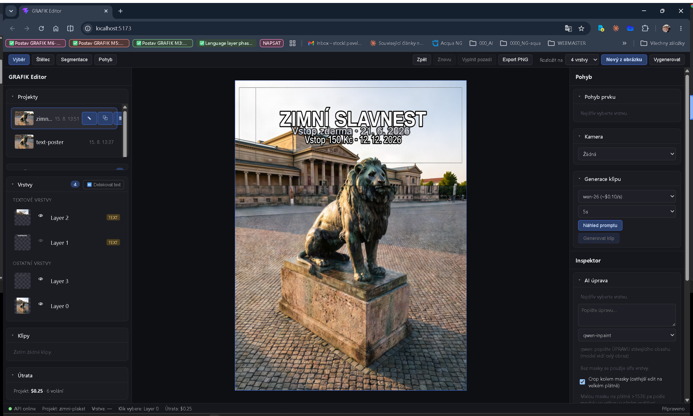
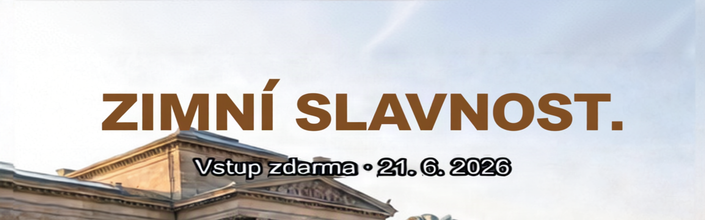
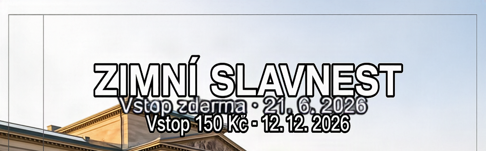

# M6-UX1 — E2E: první UX iterace z připomínek operátora (2026-08-15)

Režim „používat a ladit z reálné potřeby". Pět připomínek operátora → zvýraznění výběru na plátně, ergonomie panelů, odstranění Spike přepínače, hit-test tuning (práh + cycling překryvů + hover status), textové vrstvy v1 (detekce + badge + přepis). Akceptace klikáním v reálném Chrome nad `e2e-sc1` + novým obrázkem s textem (plakát „LETNÍ FESTIVAL" = lví kompozit + Pillow typografie).

Implementace: 2 paralelní Sonnet agenti (backend `grafik/**`+testy, frontend `ui-web/src/**`) na kontraktech orchestrátora, disjunktní soubory (M5 vzor). Testy: **207 pytest** (193→195 baseline po fc752f9 + 12 nových M6-UX1 + 2 band/re-cutout). Commity `49c91e6`…`775317c` + docs, vše ff-merge na master.

## Sonda detekčního promptu (před implementací)

Detektor textových vrstev = SAM-3 text-concept segmentace nad kompozitem + atribuce masek vrstvám podle překryvu s alfou (layout quad, `layer_mask_on_canvas`). Volba konceptu NEBYLA intuitivní — sonda na plakátu 1792×2400:

| prompt | masky | union coverage | poloha vs. text (y 94–420) |
|---|---|---|---|
| `"text"` | **0** | — | — |
| `"writing"` | 0 | — | — |
| `"white text"` | 0 | — | — |
| `"words"` | 1 | 3,80 % | jen titulek (y 94–280) |
| **`"letters"`** | **1** | **3,73 %** | **oba řádky, 100 % v pásmu** ✓ |

→ produkční konstanta `DETECT_TEXT_PROMPT = "letters"`. Vedlejší nález: fal upload URL po pár minutách expiruje (`file_download_error`) — série sond uploaduje per volání. Detail v LEARNINGS.

## Před / po

**Před** (M5 stav, e2e-sc1, vybraná vrstva):

Titěrné písmo a ikony, žádné miniatury, výběr = tenký rám, Editor/Spike přepínač, žádná indikace cíle kliku.

**Po** — výběr z panelu (Transformer restyle #4a9dff s úchyty, kompaktní čitelné řádky vrstev s miniaturami a SAM badge, sekce jako karty; status bar vpravo dole ukazuje „Klik vybere: Layer 0"):

**Hover v panelu** (figura-schody): ostatní vrstvy ztlumené na 25 %, hovered vrstva s čárkovaným obrysem `#7cc4ff`; nativní tooltip „Posunout výš" dokládá title na ikonách:

**Textové vrstvy** (zimni-plakat po přepisech): skupina TEXTOVÉ VRSTVY s badge TEXT, duchová kopie textu (Layer 1) skrytá okem, Útrata $0.25 · 6 volání, hover status v patičce:

## E2E kroky a výsledky

| # | Krok | Výsledek |
|---|---|---|
| 1 | Spike přepínač | ✅ tlačítko pryč (DOM: žádný button „Spike"); `/spike` route dál servíruje SpikeStage (path-gate v App.tsx) |
| 2 | Výběr z panelu → rám na plátně | ✅ Transformer (borderStroke #4a9dff, w2, anchory 10 px) viditelný ihned po kliku v panelu; v brush/segment/motion/busy módech trvalý outline Rect |
| 3 | Hover v panelu → zvýraznění v obraze | ✅ `hoveredPanelLayerId`: ostatní vrstvy opacity ×0,25 + čárkovaný obrys (03) |
| 4 | Hover status | ✅ „Klik vybere: {vrstva}" + při >1 překryvu počet; rAF throttle, `e.evt.buttons===0` guard (viditelné v 02 i 04) |
| 5 | Cycling překryvů | ✅ synteticky nad e2e-sc1, bod (272,400): stack {L3,L2,L1,L0} → kliky 1–5: L3→L2→L1→L0→**L3 (wrap)**; dogfooding na zimni-plakat: lev → titulková vrstva 2. klikem |
| 6 | Alpha práh | ✅ `drawHitFromCache(40)` — vrstvy bez alfy >40 v bodě (socha, figura) korektně mimo stack |
| 7 | Miniatury | ✅ vrstvy 40 px (URL sdílená s Konva loaderem → browser cache), projekty 48 px přes `GET /thumbnail` (disk cache thumb.png, 404 pro prázdný projekt → `onError` skryje) |
| 8 | Ergonomie panelů | ✅ Section karty (sbalitelné, badge, headerExtra), 13,5–14 px text, 32 px touch targety, tooltipy všude; **3 layout bugy nalezené E2E opraveny za běhu** (viz Nálezy) |
| 9 | Nový obrázek s textem | ✅ upload plakátu → decompose 4 vrstvy → **auto-detekce: „Nalezeno 2 textových vrstev."** |
| 10 | Detekce — skóre | ✅ text vrstvy 0,86/0,74 (běh 1) a 0,98/0,76 (běh 2) vs. lev 0,00 a pozadí 0,04 — práh 0,35 s velkou rezervou na obou stranách |
| 11 | Skupina + badge | ✅ „TEXTOVÉ VRSTVY" nahoře, chip TEXT (tooltip se zněním/skóre), ▲▼ disable přes z_order (funguje se skupinami) |
| 12 | Přepis textu | ✅ mechanika (viz níže); metadata `text_original`/`text_current` persistovaná, Inspector „Aktuální znění: …" |
| 13 | Cost tracking | ✅ per-projekt ledger: text-poster $0.21 · 5 volání, zimni-plakat $0.25 · 6 volání (decompose+SAM+qwen+re-cutout vše přes `tracked_subscribe`) |

## Přepis textu — iterace k použitelné v1 (nejcennější empirie dne)

1. **Pokus 1 — maska = alfa glyfů (+4 px dilate):** rozlámaná písmena přes ducha starého textu — model je uvězněný ve stopě starých tvarů, jiné tvary nemá kam kreslit. → **Pásová maska** (bbox glyfů + 0,4× výška řádku, MERGE cesta) — commit `4fb5841`.
2. **Pokus 2 — pás:** titulek čistý a jednolitý („ZIMNÍ SLAVNOST." — bronzová varianta bez originálu v promptu; s originálem drží bílou s obrysem). ALE: pásy sousedních text vrstev se protínají a **zapékají si navzájem kopie** (pás titulku nesl starý podtitulek a překryl přepsaný), iterované přepisy pás nafukují (bbox pásu > bbox glyfů). → **SAM „letters" re-cutout** po editu (+$0.005): alfa se zúží na nové glyfy, vrstva zůstane čistý text-cutout — commit `775317c`.
3. **Finální chování:** jednořádkový přepis s vyplněným původním zněním = nejlepší výsledek (styl zachován):

**Model-level limity (qwen-inpaint na plakátové typografii)** — poctivě, toto v1 neřeší:

- **Typa na malém textu:** „SLAVN**E**ST", „Vst**o**p" (1písmenkové záměny, stochastické — retry pomáhá).
- **Vícerádkový pás:** model umí text PŘIDAT místo nahradit (starý řádek zůstal, nový přibyl pod ním).
- **I2L duchové kopie:** dekompozice text zdvojila do dvou vrstev (skóre 0,98 = celá „text card") — po zúžení alfy vrchní vrstvy prosvítá duch; řešení = skrýt duchovou vrstvu (E2E) nebo inpaint-behind.
- Doporučení pro operátora: přepisovat po JEDNOM řádku, vyplňovat původní znění, při typu opakovat; na „co má VZNIKNOUT" je flux-fill (přepínač zatím jen v AI úpravě, ne v Text sekci — kandidát M6+).

## Placené cally (celé M6-UX1)

| Položka | Volání | ~USD |
|---|---|---|
| Sondy detekčního promptu (standalone, mimo projektové ledgery) | 5× SAM | 0.025 |
| text-poster (decompose + detect + 2× qwen přepis) | 5 | 0.21 |
| zimni-plakat (decompose + detect + 2× qwen + 2× SAM re-cutout) | 6 | 0.25 |
| **Celkem** | | **≈ 0.49** |

## Nálezy a limity

**Layout bugy chycené E2E (opraveny za běhu):** (a) `.project-actions` skryté přes `opacity:0` rezervovaly ~100 px → název vrstvy vytlačen + h-scrollbar (fix: `display:none` + hover/selected); (b) `.section-flex-grow` dělil zbylou výšku → Vrstvy/Klipy stlačené na ~0 px, jakmile thumbnaily zvětšily Projekty (fix: sidebar scrolluje, karty přirozená výška + cap 380 px per body); (c) svisle stohované ▲▼ à 32 px → řádek vrstvy ~85 px (fix: horizontální pár + akce jen na hover/výběr — název dostal ~140 px).

**E2E instrumentace (hidden tab claude-in-chrome):** CDP screenshot doručí zamrzlé ResizeObserver/rAF callbacky (stage 1×1 → správná velikost); Konva `getIntersection` (layer hit canvas) po resize potřebuje synchronní `stage.draw()`, zatímco `getAllIntersections` (per-shape hit) funguje i bez něj; in-page `setTimeout` smyčky throttling zabíjí → protokol „mutace v callu N, čtení v callu N+1"; `save_to_disk` u screenshotů nic nezapisuje → disk-důkazy přes DPI-aware `CopyFromScreen` viditelného okna + real-mouse SendInput. Detail v LEARNINGS.

**Známé limity v1:** detekce je binární per vrstva (žádné bboxy řádků → přepis vícetextové vrstvy je na modelu); band počítá z celé alfy (víceřádkové texty = velký pás); text_original se nevyplňuje automaticky (žádné OCR — operátor ho může zadat); duchové kopie z I2L se neřeší automaticky; rewrite sekce je fixně qwen-inpaint.

**Prostředí (jednorázové):** během OS-manipulace oken zaniklo operátorovo Chrome okno s prázdným editor tabem (minimize+restore na Chrome okně ho zavřelo; žádná data ztracena — stav je na serveru) — nahrazeno novým oknem s načteným projektem; Aqua tab v malém okně omylem přepnut a vrácen.
